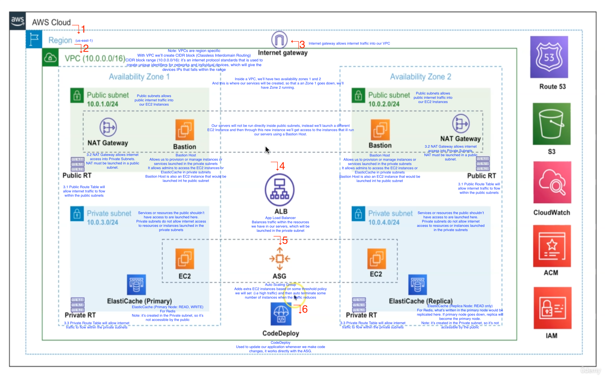
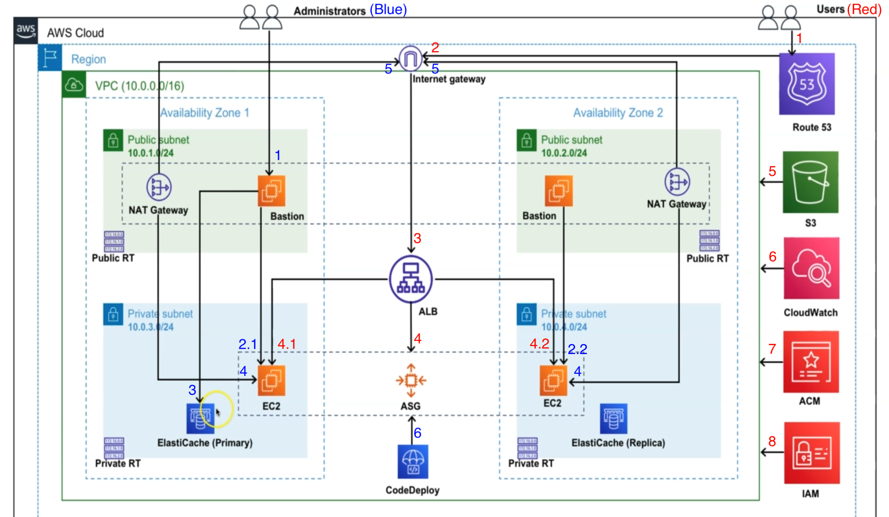

# SOCIAL NETWORK MERN - UZOCHUKWU EDDIE ODIZI

# MY TERMS

A constructor is a special function that creates and initializes an object instance of a class. In JavaScript, a constructor gets called when an object is created using the new keyword.

#  INTRODUCTION 

#  1. INTRODUCTION 

# Features Covered

Authentication
Posts
Comments
Reactions
Chat
Follow, Following, Block
Image upload
Notifications

# Backend Tools

NodeJs
MongoDB
TypeScript
Redis (used as caching layer for frequently used data: posts, comments, reactions and user data)
Sendgrid: for notifications (in proudction), nodemailer (in developement)
PM2: as process manager for our production environment
ExpressJs
Cloudinary: for storing images 
Bull Library: as a messaging queue. Before data is sent to the database (MongoDB), we'll pass the data to the message queue, then to workers, workers would read the data from message queue and send it to MongoDB

# Frontend Tools

React
Redux Toolkit
Sass
AXIOS: for making requests 
React Icons
Cloudinary 

# Infrastruction & Deployment Tools

AWS
Terraform: will be used to setup our AWS features
CI/CD (Continous Integration / Continous Development): CircleCI

# APP DEMO

# APP SECTIONS

# GITHUB REPOS

# 2. BACKEND INTRODUCTION 

# TOOLS DESCRIPTION 

NodeJs: Javascript runtime with TypeScript
MongoDB: to store data
Redis: in-memory cache
Message Queue: Redis-based message queue
Terraform: Infrastructure as code. AWS will be used to deploy, Terraform will be used to setup our infrastructure
CircleCI: CI/CD platform
Git: Version control tool, setup 3 environments STAGING, DEVELOPMENT AND PRODUCTION enivironments 
Github: Code hosting. From github, we'll connect to CircleCI and CircleCI does CI/CD
AWS: Cloud computing platform. This is where our infrastructure (AWS services) would be setup using Terraform

# APP FEATURES

Authentication: sign up, sign in, password reset, sign out, current user check
Chat/Messaging: private chat, send images in chat, add message reactions, retrieve messages, mark as read, delete messages
User: Get single user, get multiple users with pagination, select random users, edit profile
Post: Create posts (with or without images), get posts, update posts, edit posts 
Comments: add comments, get single comments, get multiple comments 
Reactions: add, get, remove reactions 
Images: add images to posts, upload profile image, background images, retrieve images, delete images 
Follow, Unfollow, Block, Unblock
Notification: Notification Settings, Retrieve & Display Notifications, Delete & Update Notifications 

# INSTALL TOOLS
Install the tools that are needed to go through the course by using the links below:

NodeJS (You can install the current version or the current LTS version. I would recommend the current LTS version) - https://nodejs.org/en/

MongoDB - https://www.mongodb.com/docs/manual/administration/install-community/

MongoDB Compass - https://www.mongodb.com/try/download/compass

Redis - https://redis.io/docs/getting-started/installation/

VSCode or any suitable IDE of choice - https://code.visualstudio.com/download

# VS CODE EXTENSIONS

Throughout this course, I will be using some vscode extensions. You can install these extensions if you want. Its optional to install the extensions.

Auto Import - https://marketplace.visualstudio.com/items?itemName=steoates.autoimport

EditorConfig - https://marketplace.visualstudio.com/items?itemName=EditorConfig.EditorConfig

ENV - https://marketplace.visualstudio.com/items?itemName=IronGeek.vscode-env

ES7+ React/Redux/React-Native - https://marketplace.visualstudio.com/items?itemName=dsznajder.es7-react-js-snippets

ESLint - https://marketplace.visualstudio.com/items?itemName=dbaeumer.vscode-eslint

HashiCorp Terraform - https://marketplace.visualstudio.com/items?itemName=HashiCorp.terraform

Prettier - Code formatter - https://marketplace.visualstudio.com/items?itemName=esbenp.prettier-vscode

REST Client - https://marketplace.visualstudio.com/items?itemName=humao.rest-client

SCSS Formatter - https://marketplace.visualstudio.com/items?itemName=sibiraj-s.vscode-scss-formatter

vscode-icons - https://marketplace.visualstudio.com/items?itemName=vscode-icons-team.vscode-icons

YAML - https://marketplace.visualstudio.com/items?itemName=redhat.vscode-yaml

# 3. BACKEND: PROJECT SETUP

# INTRODUCTION

# CREATING BACKEND PROJECT

Goto terminal
Create your project backend: mkdir chatly-backend (i.e project name)
Cd into the newly created dir: cd chatly-backend
Open your project in vscode: code .
Create package.json file: npm init -y. This file will hold our dev dependencies, meta data and script commands
Goto package.json, change the value for "main": to app.js which will serve as the entry point of our application
Install typescript: brew install typescript
Init typescript: tsc --init . This creates a tsconfig.json file, which holds the configurations we want to use for our TS project

# TS CONFIG

Copy the tsconfig.json file provided in the course and paste it in yours

# FOLDER STRUCTURE SETUP 
Create your src folder as specified in the tsconfig.json file. This folder will house all our codes for the project
Create a dir features in the src dir
Create a dir shared in the src dir (it will house all reuseable components/codes)
Create a dir globals in the shared dir
Create a dir services in the shared dir (this will house everything related to mongodb)
Create a dir sockets in the shared dir (this will house everything related to socketIO)
Create a dir workers in the shared dir (this will house the workers that will read data from the message queue)
Create a dir db in the services dir (this will house files for db connection, making queries to mongodb)
Create a dir queues in the services dir (this will hold data queues before sending to db)
Create a dir emails in the services dir (this will hold our email service)

Create app.ts in the src dir (this is our entry file)
Create config.ts, routes.ts in the src dir
Create setupDatabase.ts in the src dir (this is for connection to db)
Create setupSever.ts in the src dir (this is for our application/project server, starting the server)

# SETUP SERVER CLASS (setupSever.ts)

Install express: npm i express (server framework)
Import {Application, json, urlencoded, Response, Request, NextFunction } from express 
Install declaration file for express: npm i --save-dev @types/express
Create a class ChattyServer

# STANDARD MIDDLEWARE (setupSever.ts)

Install the middleware libraries: npm i cors helmet hpp cookie-session compression express-async-errors http-status-codes

- cors, helmet, hpp: security middlware
- cookie-session, compression: standard middlware
- express-async-errors: to catch errors coming from asycn await methods
- http-status-codes: for http status codes

Import the libraries you just installed, install their file declarations
Setup your middlewares methods

# SETUP HTTP SERVER PART 1 (setupServer.ts)

Create a var SERVER_PORT
Inside startHttpSever middleware, listen to your server port
Make the startServer middleware async with Promise, create your server in the method

Goto app.ts, 
Import express, ChattyServer i.e our Application server class from setupServer.ts
Create a class Application, Create an instance of it (i.e a var application)

Install nodemon: npm i -g nodemon . This will help help us to restart / refresh the server
Goto package.json, add "dev" key to the the scripts object. This will be used in running our sever by just calling the keys defined.

# SETUP HTTP SERVER PART 2 (setupServer.ts)

Install ts-node as dev dependency: npm i ts-node -D . This allows us to run typescript locally
Run cmd: npm run dev (the script key we created in package.json, to start our application)
After this you should have your server running: "Server running on port 5000"
- Hint:  Use this to kill all other running port: killall -9 node
Install tsconfig-paths library for typescript to recognize our absolute path changes e.g from ../../../ to @feature/. CMD: npm install --save-dev tsconfig-paths
Paste this inside the dev key in scripts object in package.json: -r tsconfig-paths/register

# DATABASE CONNECTION SETUP (setupDatabase.ts)

Install mongoose: npm i mongoose
Goto setupDatabase.ts, Import mongoose
Create an anonymous default function 
Goto app.ts, import your databaseConnection with any name (because it's an anonymous func) from the setupDatabase
Invoke the databaseConnection() inside the initialize()
Run you app: you should get the below:

Server running on port 5000
Connection to database successful!

# ENVIRONMENT CONFIG CLASS PART 1 (config.ts)

We want to setup our environment variables for the project in .env file, so we can call them using process.env.the var wherever we need them.

Install env: npm i dotenv
Create a .env file in the root of the project
Create the following environment variables in it:
DATABASE_URL, JWT_TOKEN, NODE_ENV, SECRET_KEY_ONE, SECRET_KEY_TWO, CLIENT_URL

Goto config.ts, import dotenv
Load all environment vars from .env file using dotenv.config
Create a class Config, Create and instance of it
Add all environment vars in the .env file inside the Config{} class publicly
Create a constructor for the Config{} class
Create a method validateConfig() for the Config class

Goto app.ts
Inside the Application class, create a method loadConfig
Import the exported instance of the Config class from config.ts i.e const config in app.ts
Call loadConfig() in the initialize()

# ENVIRONMENT CONFIG CLASS PART 2 (config.ts)
We want to make use of our environment values

Goto setupServer.ts
Import the exported instance of the Config class from config.ts
Inside the securityMiddleware > cookieSession: use config.the_env_varName to set the values for the keys property and other properties in other middlewares

Goto setupDatabase.ts, Import config from config.ts
Use config to call the database url in the connect()

# SOCKET IO SETUP (setupServer.ts)

Install socket.io/redis-adapter: npm install @socket.io/redis-adapter redis socket.io
* This allows to broadcast events between several socket.io servers. (i.e to maintain communications when using socket.io, if a user disconnects and the reconnects, commmunication will continue)
Goto setupServer.ts, Import Server from socket.io
Import createClient from redis
import createAdapter from @socket.io/redis-adapter
Inside the createSocketIO middleware
Create an instance of the SocketIO server
Create REDIS_HOST env var in .env file, add it to Config class in config.ts
Create pubClient, subClient
Create an instance of socketIO in the startServer()

Create a method socketIOConnections()
Call socketIOConnections() inside the startServer method
Start redis server in a separate terminal: redis-server 
Start MongoDB service in separate terminal: brew services start mongodb-community@6.0
Start your app: npm run dev

# ROUTE FUNCTIONS (routes.ts)

Goto routes.ts

Create an anonymous function, pass in express Application
Goto setupServer.ts, import applicationRoutes (we're importing it with any name because it's an anon func) from routes.ts
Inside the routesMiddleware, call the applicationRoutes and pass in app

# GLOBAL ERROR HANDLER (error-handler.ts)

Create a new dir helpers in src > shared > global
Create a file error-handler.ts in the dir 
Import http-status-codes
Create interfaces IErrorResponse, IError
Create an abstract class CustomError
Create error class as per your usage: BadRequestError, NotFoundError, NotAuthorizedError, FileTooLargeError, ServerError.

Goto setupServer.ts, inside the globalErrorHandler middleware
Use app.all(), app.use()

# LOGGER SETUP - BUNYAN (i.e custom error logger instead of using console.log) (config.ts)

Install bunyan: npm install bunyan
Install it's file declaration type: npm i --save-dev @types/bunyan
Goto config.ts, Import bunyan from bunyan
Create a method createLogger()

Goto setupServer.ts, import Logger
Create an instance of the createLogger
Use log.error, log.info in the setupServer.ts to display logs/errors as per your usage 
Repeat the above steps for setupDatabase.ts

Goto package.json, add | ./node_modules/.bin/bunyan to your "dev" script
Start you app, you should see something like below 

[2022-11-07T10:37:24.732Z]  INFO: setupServer/8073 on OpeCodeds-MacBook-Pro.local: Server has started with process 8073
[2022-11-07T10:37:24.735Z]  INFO: setupServer/8073 on OpeCodeds-MacBook-Pro.local: Server running on port 5000
[2022-11-07T10:37:24.818Z]  INFO: setupDatabase/8073 on OpeCodeds-MacBook-Pro.local: Connection to database successful!

# ESLINT SETUP (error-handler.ts)

Install VSCode extension editorconfig, eslint, prettier if you haven't
Install these libraries as dev dependencies: npm i -D eslint-config-prettier prettier @typescript-eslint/eslint-plugin @typescript-eslint/parser
Create a file .editorconfig in the root of the project
Copy and paste the editorconfig snippet from their website in the file

Create a file .prettierrrc.json in the root of the project
Create a file .eslintrc.json in the root of the project

Goto package.json, add a new script lint:check, lint:fix, prettier:check, prettier:fix to the scripts object

Run: npm run lint:check - to check for lint errors
Run: npm run lint:fix - to fix lint errors
- [run the above as well for prettier ]

# CREATE GITHUB REPO

Goto github, create a new repo: chatly-backend
Create a file .gitignore, .eslintignore in your project root, generate a template from gitignore.io by just typing node, then hit the search button. Paste it in your .gitignore and .eslintignore file

Run the following in your project: 
rm -rf .git: stops an initialized git repo from reintitializing
git init
git add .
git commit -m "chatly-backend project setup"
git branch -M main
git remote add origin https://github.com/OpeCoded/chatly-backend.git
git push -u origin main

- Note: we're going to have 3 environments (development i.e coding/local dev, staging i.e testing and production i.e live)
- main/master will be our production branch

So, on your github project create 2 new branches: development, staging
Set the development branch as default

Switch to development branch: 
git fetch
git checkout development

# CHANGE ABSOLUTE IMPORTS

We want to change paths for our imports to use absolute paths e.g @shared/routes.ts

Install these two libraries: npm i ttypescript typescript-transform-paths
- ttypescript module: we'll use to build our typescript app instead of the tsc command, else we'll get errors while building our app because we changed our paths to absolute
- typescript-transform-paths module: will help us to transform the absolute paths we created to regular paths in our build file
Goto tsconfig.json, add a plugins: key. Add typescript-transform-paths in the objects
Add a paths: key, in here we specify our absolute paths. Note: "@root/*" path should be the last in the object

Goto previous files you've create and put the absolute paths in use by changing the import paths 

# BUILD SCRIPT

We want to add the build command to build our app

Goto .gitignore, .eslintignore add build
Goto package.json, in the scripts object add a new command/key "build". This will help us to convert our project from typescript to javascript
Run npm run build: to build our app

# 4. BACKEND AUTHENTICATION FEATURE

# REDIS COMMAND

- Redis datatypes

Strings
Lists
Sets: an unordered list of data
Hashes: are objects, with fields (keys) and values
Sorted Sets: ordered or grouped list of data

- Redis Commands

List Commands 

LPUSH : prepends values at the beginning of a list (Left)
LRANGE: used to get a range of elements from a list
LINDEX: gets an element from a list by its index
LLEN: gets the length of a list
LREM: removes an element from a list
LSET: sets the value of an element in a list by it's index
RPUSH: appends one or more values to a list from the Right

*started making screenshots from here

# CLOUDINARY UPLOAD FUNCTION 

Login to your cloudinary dashboard
Copy your cloudname, api key and api secret.
Add them to you .env file AND config.ts (class and constructor) file

Install cloudinary: npm install cloudinary
Goto config.ts, Import cloudinary 
Create a method cloudinaryConfig
Goto app.ts, inside the loadConfig(), call cloudinaryConfig()

Inside src > shared > globals > helpers, create a file cloudinary-upload.ts
Import cloudinary, UploadApiResponse , UploadApiErrorResponse
Create a function uploads()

# AUTH VALIDATION SCHEMES

- Validation schemas for sign up and password reset
- Joivalidation module for form validation 
- * later, we'll create a TS decorator, based on the decorator our validations will be performed based on the data sent through the request body 

Install Joi: npm i joi
In the features dir, create a new dir auth

Inside the auth dir create the following dir:

controllers: this will contain the business logic
interfaces: Interface is used for validating the structure (model) of an entity. An interface defines the syntax that any entity (e.g user, post) must adhere to. It's like a contract of how the data you want to define or the data you're expecting should look like.  
models: This is the structure of an entity (i.e a collection/table) - for mongoDB
routes: routes/urls for auth
schemes: schemes for validation during sign up

In the schemes dir, create files signup.ts, signin.ts (copy and paste the file provided)

# JOI VALIDATOR DECORATOR
A decorator is like a spacial declaration that can be attached to a class/method

- We want to create a typescript decorator that will be used to perform validations using joi validation module. In this case to validate our req.body properties

Create a new branch for our auth-feature: git checkout -b feature/auth-feature [everything related to auth will be in this branch]
Inside src > shared > globals create a decorators dir 

Inside the decorators dir, create a file joi-validation.decorators.ts
Import JoiRequestValidationError, Request, ObjectSchema

Create a type IJoiDecorator
Create a func joiValidation

# AUTH INTERFACE AND MODEL SCHEMA (dir: scr/features/auth)

We want to create our interfaces and model user authentication features

Create a file auth.interface.ts in the interfaces dir
Copy and paste the file you were provided with 

Goto you tsconfig.ts file and define the absolute path for auth in the paths {} which will be used when importing
Create a file auth.schema.ts in the models dir (auth collection)
Copy and paste the file you were provided with 

Install bycryptjs: npm i bcryptjs
Install it's file declaration type: npm i --save-dev @types/bcryptjs

# SIGN UP USER METHOD PART 1 (SignUp Controller)

We want to create a method to create a user > add the user to redis cache > save the user to MongoDB

Install modules: npm i jsonwebtoken lodash
Install their types: npm i --save-dev @types/jsonwebtoken @types/lodash

Create a file signup.ts in features/auth/controllers
Import ObjectID (mongodb id to be saved to the db), request and response
Create a class SignUp, inside the class create a method create()

- To check if a username and email already exist we need to create a service

Create a file auth.service.ts in shared > services > db
Create a class AuthService, create a method getUserByUsernameOrEmail

Create a file helpers.ts in src > shared > globals > helpers

# SIGN UP USER METHOD PART 2 (SignUp Controller)

Create a method signUpData

# AUTH ROUTES

Create a file authRoutes.ts in features/auth/routes
Import the required
Create a class AuthRoutes
Goto project routes.ts file, Create var BASE_PATH
Add the authRoute to the route()

Use Rest Client VSCode extension to test the endpoint:
Create a dir endpoints in the root of the project
Create a file auth.http in it (this will house all endpoints for our authentication requests)

Define baseUrl and urlPath
Define a post req to create a user

Start your redis server, mongo db and run your app
Send a request to the /signup endpoint in auth.http file
If your req was successful, you picture would be uploaded to cloudinary

# USER INTERFACE AND MODEL SCHEMA

How users created would be saved to mongo db in terms of data types

Create a dir user in the features dir
Inside the user dir, create dirs models, interfaces

Create a file user.interface.ts in the interfaces dir 
Copy and paste the file you're provided with 

Create a file user.schema.ts in the model dir 
Copy and paste the file you're provided with 

# REDIS BASE CLASS
We want to save frequently used/accessd data by users in our app in the redis-cache to speed up data retrieval instead of waiting for data to be fetched from the db, so we want to setup our redis connection 

Goto shared > services > redis
Create a file base.cache.ts, Import the required
Create a class BaseCache
Create a file redis.connection.ts, Import the required
Create a class RedisConnection
Goto setupDatabase.ts, call redisConnection.connect(); in the .then()

Run your app: you should have Redis connection: PONG in the log

# SAVE USER TO REDIS CACHE PART 1

Create a file user.cache.ts in the redis dir
Import BaseCache
Creat a class UserCache
Create a method saveUserToCache

# SAVE USER TO REDIS CACHE PART 2

Goto signup.ts in the controllers dir
Create a method userData
Create an instance of UserCache() on top of the file
In the create(), call saveUserToCache(..pass in args) to add user to redis cache

# INSTALL REDIS COMMANDER (GUI FOR REDIS)

Install: npm install -g redis-commander
Ensure redis-server is running on your machine
Run: redis-commander in terminal
Start your app: npm run dev
Using your endpoint auth.http req file, try to create a new user and check if it's in redis db

# BASE MESSAGE QUEUE

We want to create queues and workers which will be used in sending data to our mongodb

Queue => Worker => MongoDB

Bull is used to create  queues and workers
Install bull: npm install bull --save
Install bull GUI modules: npm i @bull-board/express @bull-board/ui

Create a file base.queue.ts in the services/queues dir
Import the required
Create vars bullAdapters, serverAdapter
Create a class BaseQueue

 
 # BASE QUEUE ADD JOB METHOD

Methods to add data to the queue and process jobs inside the queue

Create a method addJob(), processJob()
Goto routes.ts, add the /queues basepath to the routes(). This will allow us to see our jobs in the Bull GUI
Before testing, create atleast a queue

Create a file auth.queue.ts in the shared > services > queues dir
Create a class AuthQueue, 
Goto base.queue.ts, create a type IBaseJobData
Pass the IBaseJobData as data: in the addJob()
Goto signup.ts in the controllers dir
Import omit, use omit() to remove props we don't want to save to the mongo db
Use authQueue.addAuthUserJob (AuthQueue class) to add the user data created to the queue as a job
Cmd: npm run dev
Goto Bull Dashboard: localhost:5000/queues

# AUTH QUEUE AND WORKER
- Use the auth queue for explanations

We want to create a worker that will process the jobs, send it to a method that will add the data to mongodb

- Saving a user to cache 

Create a file auth.worker.ts in the shared > workers dir
Import the required
Create a class AuthWorker, Create a method addAuthUserToDB()
Goto auth.service.ts, create a method createAuthUser
Goto auth.worker.ts call createAuthUser() in the addAuthUserToDB()
Goto auth.queue.ts, in the constructor() call the processJob() and passing the required values

- Saving a user to mongodb 

Create a file user.worker.ts in the workers dir (you can duplicate the auth.worker.ts and make changes) 

Create a file user.service.ts in service > db dir
Create a class UserService
Goto user.worker.ts,  call userService.addUserData in the addUserToDB()
Create a file user.queue.ts in the shared > services > queues dir (you can duplicate the auth.queue.ts)
Goto controllers > signup.ts, call userQueue.addUserJob() in the create method

# ADD JWT TO SESSION

We want to add JWT using our session using cookie session module

Goto signup.ts (controller)
Create a method signToken(), Import JWT
In the create() create a var userJwt, req.session

# VIEW MONGO DB DATA WITH COMPASS

Run your request to create a new user in the auth.http file
Check your mongodb compass, you will see you db has been created with the name you specified in your .env file for DB_URL
You will have to collections Auth and User, the Auth is contains auth credentials, while the user contains the user bio data but the authId is referenced in the User collection

# USER LOGIN CONTROLLER
- Note: this looks like the signup section, so check sign up comments for explanations

We want to implement the sign in / login feature

Goto feature > auth > controllers 
Create a file signin.ts, create a class SignIn
Create a method read(), import the required
Create a method getAuthUserByUsername in auth.service.ts
Goto authRoutes.ts, create the signin route in the routes()
Goto auth.http, create a request for signin pointing to /signin route
Test it

# FIX LOGIN BUG

Initially we're passing the id of a user in the Auth collection to userId while signing JWT which is wrong, so we want to pass the actual id created in the User collection in MongoDB

Goto user.service.ts, Create a method getUserByAuthId()
Goto signin.ts, create a var user, pass it to JWT.sign()

# UPDATE LOGIN CONTROLLER

Goto singin.ts, create a var const userDocument: IUserDocument, pass userDocument in the res.status() for user

# USER LOGOUT CONTROLLER

Create a file signout.ts in features > auth > controllers
Import the required
Create a class SignOut, create method update()
Goto authRoutes.ts, Create a method signoutRoute()
Goto routes.ts (root), create the base path for signoutRoute()
- To test:
Goto auth.http, create a get req pointing to the /signout route

# GET USER DATA FROM REDIS CACHE

We want to create a controller to check if the current user is a valid user and has a valid user token

We need 2 methods: Method to get the user data from the cache (using HGETALL)
- hgetall users:638cf42cf6ac60372572885c
And the other method, from the database

Note: while saving data to the cache, we stringify them using JSON.stringify, so we need to convert them back to json using json.parse

Goto globals > helpers > helper.ts
Create a method parseJson()
Goto user.cache.ts, create a method getUserFromCache()

# GET USER FROM MONGODB BY ID PART 1

Goto shared > services > db > user.service.ts
Create a method getUserById()

# GET USER FROM MONGODB BY ID PART 2

Continued - getUserById()
Create a method aggregateProject()

# CURRENT USER CONTROLLER

Create a file current-user.ts in features > auth > controllers
Create a class CurrentUser
Create a file currentRoute.ts in controllers > routes
Create a class CurrentUserRoutes
Goto the root routes.ts file, create a base path for /currentuser route

# AUTHENTICATION MIDDLEWARE

We want to create 2 middleware methods to set the currentUser value or payload (auth.interface.ts) i.e init value

First middleware verify if the user token (JWT) is valid before an auth req is being sent: verifyUser()
Second middleware verifies if the currentUser actually exists: checkAuthentication()

Create a file auth-middleware.ts in the globals > helpers dir
Import the required
Create a class AuthMiddleWare
Create a method verifyUser()
Goto currentRoute.ts, add authMiddleware.checkAuthentication in the route path for ocurrentuser
Goto routes.ts (root), add authMiddleware.verifyUser to the currentUserRoutes base path
Goto auth.php file, test the /sigin,  /currentuser endpoints respectively

# MERGE FEATURE BRANCH TO DEVELOP

We want to push what we have done so far (our code), create a pull request and merge it to development.

Run the below CMDs:

npm run lint:check => This checks for lint errors
npm run prettier:check
npm run prettier:fix => This fixes all prettier errors
git add .
git commit -m "Feature: Implemented Auth Feature"
git push origin feature/auth-feature => Creates a new branch "feature/auth-feature" NB: deny any prompt that comes
Visit the PR (Pull Request) link generated in the cmd i.e https://github.com/OpeCoded/chatly-app-backend/pull/new/feature/auth-feature
Click on Create PR > Merge Confirm

# BACKEND AUTH PASSWORD RESET

# MAIL TRANSPORT CLASS

We want to create methods that would be used to send emails on production and local development with different libraries for each.

Nodemailer (local)
Sendgrid (production)
ejs (email templating engine)

Switch to or create a new branch: git checkout -b feature/password-reset-feature
Install modules to send email: npm i nodemailer @sendgrid/mail ejs
Install the type declarations of the above

Goto .env and create the following keys:
SENDER_EMAIL
SENDER_EMAIL_PASSWORD
SENDGRID_API_KEY
SENDGRID_SENDER

Goto config.ts and define the properties of the above keys 

Create a file mail.transport.ts in shared > services > email
Import the required
Create an interface IMailOptions
Create a class MailTransport
Goto nodemailer.com/about to copy the required methods (reference)

# TEST DEV EMAIL SENDER

Goto ethereal.email to create an ethereal account in order to have a sender email and password
Paste the credentials in your .env file where appropriate
Start your server in cmd and run your app

- We want to test the developmentEmailSender while signing up (signin.ts controller)

Goto signin.ts, call mailTransport.sendEmail() after signing userJwt. Pass in 3 required args (sender email, subject, body)
- Note: use a wifi incase you're not receiving an email or try another network. Cus you have to be on the same network as the smtp server.
Goto auth.http , test your signin endpoint and see if an email would drop in the ethereal.email inbox

# EMAIL QUEUE AND WORKER

Objective: Add email (job) to queue => Worker then send the email

Create a file email.queue.ts in the queues dir
Create a class EmailQueue
Create a method addEmailJob, add it's interface to the BaseQueue (base.queue.ts)
Create email.worker.ts in the workers dir
Create a class EmailWorker
Goto email.queue.ts, call processJob()

# PASSWORD RESET TEMPLATES

Create a dir templates in service > emails
Create two dirs forgot-password, reset-password in the templates dir
Inside the forgot-password dir create a file forgot-password-template.ts and forgot-password-template.ejs
Copy and paste the snippets provided for forgot-password-template.ejs

Goto forgot-password-template.ts, Import the required
Create a class ForgotPasswordTemplate

Inside the reset-password dir create a file reset-password-template.ts and reset-password-template.ejs
Copy and paste the snippets provided for reset-password-template.ejs

# TEST EMAIL WITH PASSWORD RESET TEMPLATES

Goto signin.ts, create a var resetLink
Create a var template
Call emailQueue.addEmailJob()

- Test sending the email using your signin.ts controller. NOTE: to test, update the sender email and pass in your .env with the one you've sepecified for receiver. Else it won't deliver

For confirmation email after password has been changed
Install the following: npm i moment ip
Import them in signin.ts
Create a var templateParams
Call emailQueue.addEmailJob. Note: you can create a separate job for confirmation email but we used the addEmailJob

# FORGOT PASSWORD CONTROLLER METHOD

Create a file password.ts in the auth > controllers dir
Import the required
Create a class Password
Create a method create()
Create a method getAuthUserByEmail(), updatePasswordToken() in auth.service.ts
Goto authRoutes.ts, add /forgot-password and /reset-password/:token route to the routes()

# RESET PASSWORD CONTROLLER METHOD

This method will change the password and send a confirmation email that the user's password was changed

Goto password.ts
Create a method update()
- We want to check if the passwordRequestToken has not expired and if passwordResetToken exists
Goto a auth.service.ts, create a method getAuthUserByPasswordToken()
Goto authRoutes.ts, create a route for reset-password and pass the token param
Testing: Create a new request for routes /forgot-password and /reset-password in the auth.http file
Test the 2 new endpoints, copy token sent to the email and add it to the request to change the password

# JEST CONFIG

We want to setup our unit test using Jest, we'll be testing only our controller methods

Install Jest: npm install --save-dev jest
Install Jest types: npm i @types/jest, npm i @jest/types, npm i -D ts-jest

Create a file jest.config.ts in the root of the project
Import the required
Create a var config

# UNIT TEST SCRIPT COMMAND

Goto package.json, add "test" key to the scripts object

# AUTH UNIT TEST MOCK

PURPOSE OF TESTING: to check if we're getting the expected/correct response

- Test for sign up, we're going to be mocking data to be used for our tests, we won't be using real data from the DB. 

Create a dir test in the controllers dir
In the src dir, create a dir mocks
In the mocks dir, create a file auth.mock.ts - In here, we will mock our request and response data for sign up
Import the required
Create a func authMockRequest
Create a func authMockResponse

# SIGN UP UNIT TEST P1

We want to test if some required credentials values are not supplied when a user is trying to signup

Create a file signup.test.ts in the controllers > test dir 
Import the required
Create a jest describe()
To test, run: npm run test [this runs all test files in your source file]

# SIGN UP UNIT TEST P2

Use the it() to create other tests like we did above in part 1

# CLEAR MOCKS

We want to reset our mocks test before another test runs and clear all mocks after a test has finished

Goto signup.test.ts
Create a method beforeEach() in the describe()
Call resetAllMocks() inside it
Create a method afterEach()
Run npm run test [with the path of the test file]

# LOGIN UNIT TEST

We want to create a test for our sign.ts controller method

Create a file signin.test.ts in the test dir
Copy and paste the snippet provided
Run npm run test [with the path of the test file]

# PASSWORD RESET & LOGOUT UNIT TEST

Create a file password.test.ts, signout.test.ts in the test dir
Copy and paste the snippet provided
Run npm run test [with the path of the test file] to run individual test

# CURRENT USER UNIT TEST

Create a file user.mock.ts in the mocks dir

Create a file current-user.test.ts, signout.test.ts in the test dir
Copy and paste the snippet provided
Run npm run test [with the path of the test file] to run individual test

# PUSH CODE TO GITHUB

git add .
git commit -m "feature: implemented password reset feature with unit tests"

# BACKEND POST FEATURE

# SECTION INTRODUCTION

# POST INTERFACE, MODEL AND SCHEMA

Create a dir post in the feature dir
Add the path to the post dir to tsconfig.json, jestconfig.ts
Create the following dirs in the post dir controllers, interfaces, models, routes, schemes
Create a file post.interface.ts in post > interfaces dir
Create a file post.schema.ts in the post > models dir
- Copy and paste the snippets provided in the files above

Note: for schemas, you only add index: true to a field you're sure you're going to use to make a queries (i.e primary key)

# POST JOI VALIDATION SCHEME

Create a file post.schemes.ts in post > schemes dir
Copy and paste the snippet provided

- Note: we'll have 2 controllers for post upload. 
1. Post without image. 
2. Post with image

# SOCKECT IO POST HANDLER

We want to setup socketIO connection 
For immediate response from the server when a user makes a post

Create a file post.ts in shared > sockets
Import the required
Create a class SocketIOPostHandler

Goto setupServer.ts, inside socketIOconnections(), create a var postSocketHandler

# CREATE POST CONTROLLER METHOD

Create a file create-post.ts in post > controllers
Import the required
Create two method post, postWithImage

# SAVE POST TO REDIS CACHE

We want to save posts inside redis as a hash

Create a file post.cache.ts in shared > services > redis dir 
Import the required
Create a class PostCache
Create a method savePostToCache

# USE savePostToCache() inside create-post.ts controller

Goto create-post.ts
Create a var postCache
In the post(), call postCache.savePostToCache() and pass in the req args to be saved in the cache
Create a file postRoutes.ts in the post > routes dir
Create a class PostRoutes
Goto to the root routes.ts file and create a base path for postRoutes
TESTING:
Ensure you sign in a user before testing
Create a file posts.http in the endpoints dir
Send a request to this endpoint: POST {{baseUrl}}/{{urlPath}}/post

# ADD POST SOCKECT IO EVENT

We want to emit posts events in our post controller

Goto creat-post.ts, call socketIOPostObject.emit() in the post()

# POST QUEUE AND WORKER

Create a file post.queue.ts in service > queues
Create a class PostQueue
Add IPostJobData to the base queue
Create a file post.worker.ts in the workers dir
Create a class PostWorker
Create a file post.service.ts in the services dir
Create a class PostService
Createa a method addPostToDB
Goto post.worker.ts, call postService.addPostToDB inside the savePostToDB()
Goto create-post.ts controller, call postQueue.addPostJob() inside the post()

# POST WITH IMAGE CONTROLLER METHOD

Goto create-post.ts
Create a method postWithImage()
Goto postRoutes.ts, create a route for post/image/post

# CREATE POST UNIT TEST
 
Create a file post.mock.ts in the mocks dir
Copy and paste the snippet provided
Create a dir test in the post > controller dir
Create a file create-post.test.ts
Copy and paste the snippet provided

# GET POST FROM REDIS CACHE

We want to create methods to fetch get multiple posts, single posts etc

Post fetching: redis > mongodb

Goto post.cache.ts
Create a method getPostsFromCache()

# GET TOTAL POST COUNT FROM CACHE

Goto post.cache.ts
Export a type PostCacheMultiType

Create getTotalPostsInCache(), getPostsWithImagesFromCache(), getUserPostsFromCache()

# GET POST FROM MONGODB

Create a method getPosts(), postsCount()

# GET POST CONTROLLER 

Create a file get-posts.ts in controllers > post 
Import the required 
Create an instance of PostCache
Create a class Get
Create a method post(), postWithImages()

# GET POSTS ROUTES

Goto postRoutes.ts
Create get routes Get.prototype.posts, Get.prototype.postsWithImages

Goto post.http to test the endpoint Post get

# GET POST CONTROLLER UNIT TEST

Create a file get-post.test.ts in post > controller > test
Copy and paste the snippet provided
Run: npm run test <file-path>

# DELETE POST CONTROLLER 

We want to create a method to delete a post from redis cache for a particular user
We're going to delete the item from the set and hash

Goto post.cache.ts
Create a method deletePostFromCache()
Goto post.service.ts
Create a method deletePost()
Goto post.worker.ts
Create a method deletePostFromDB()
Goto post.queue.ts, add the job method deletePostFromDB() to the PostQueue class

Create a file delete-post.ts in the post > controller dir
Import the required
Create a class Delete
Create a method post()

Goto postRoutes.ts
Create a route delete()

Test in post.http

# DELETE POST CONTROLLER UNIT TEST

Create a file delete-post.test.ts in post > controller > test
Copy and paste the snippet provided
Run cmd: npm run test <file-path>

# UPDATE POST IN REDIS CACHE

Goto post.cache.ts
Create a method updatePostInCache()

# UPDATE POST CONTROLLER 

Goto post.service.ts
Create method editPost()
Goto post.worker.ts 
Create a method updatePostInDB()
Goto post.queue.ts
Add a job updatePostInDB to the queue
Create a file update-post.ts in post > controllers dir

# UPDATE POST WITH IMAGE CONTROLLER

Goto update-post.ts
Create a method postWithImage()
Create a private method updatePostWithImage(), addImageToExistingPost
Goto postRoutes.ts, create routes to update ordinary post and post with image i.e /post/image/:postId

Test in the posts.http

# UPDATE POST CONTROLLER UNIT TEST

Create a file update-post.test.ts in post > controllers > test

Copy and past the snippet code provided

<NOTE: in testing, ensure the status response in the controller tallies with the one in the test.ts file, else the test will fail

# PUSH CODE TO GITHUB

git checkout -b feature/post-feature
git add .
git commit -m "feature: added post features"
git push origin feature/post-feature
git push

# FIX TS CONFIG ISSUE

Goto tsconfig.json
Change the value of the rootDir to "." instead of "scr"

# NEW VIDEOS ADDED TO THE COURSE

# SECTION 3

# Update dependencies

- We want to update the libraries in package.json file, remove the ones not needed anymore.

Run npm update

Install package bullmq: npm i bullmq

# Update build script

ttypescript package converts an alias path to it's relative path, we want to use a better one which is tsc-alias.

npm uninstall ttypescript
npm install --save-dev tsc-alias
Update your package.json with this:   "build": "tsc --project tsconfig.json && tsc-alias -p tsconfig.json",
Run npm run build
 * check your build folder, you'd notice the tsc-alias package replaced alias paths (@user/) with relative paths (./../) after typescript compilation

 # SECTION 6

 # Update redis HSET method in post cache

HSET takes in 3 args in the new version of redis
HSET('key', 'field', 'value')

Convert your dataToSave from an array to an object, then loop through it to get each itemKey and itemValue then save to cache

# BACKEND POST REACTIONS FEATURE

# Reaction interface, model schema and joi schemes.

Create a new branch: git checkout -b feature/post-reactions-feature
Create a dir reactions in the features dir
Create the following dirs in the reactions dir: controllers, interfaces, models, routes, schemes.

Create respective files using the snippet provided for interfaces, models and schemes
Add the paths to the reaction feature in your tsconfig.json and jest.config.ts file

# Add post reaction to cache

Create a file reaction.cache.ts in services > redis
Create a method savePostReactionToCache()

# Remove post reaction from redis cache

Create a method removePostReactionFromCache()

# Add reaction controller

Create a file add-reactions.ts reactions > controllers dir
Create a class Add {}
Create a method reaction()
Create an instance of ReactionCache

Create a file reactionRoutes.ts in the reactions > routes dir 
Create a class ReactionRoute{}
Add reactionRoutes to the the base routes.ts file

Test the route in your endpoint
Create a file reactions.http
Test the post endpoint

# Fix add reaction issue

helpers.ts file parseJson()
Add this: return JSON.parse(prop);

# Add post reaction to mongodb

Create a file reaction.service.ts in db dir
Create a class ReactionService
Create a method addReactionDataToDB()

# Post reaction queues and worker

Create a method removeReactionDataFromDB()

Create a new file reaction.queue.ts in the queues dir
Create a method addReactionJob()
Add IReactionJob to the base.queue.ts file
Create a file reaction.workers.ts in the workers dir
Create class ReactionWorker
Create a method addReactionToDB(), removeReactionFromDB()

Create a fresh post and try to add reaction to it
Test in your reaction.http endpoint
Check your redis and DB to ensure all works

# Fix add reaction to mongodb error

While creating our reactioinObject in add-reactions.ts, we're creating our own reaction id where as mongodb will also create another one for us. So by the time a user wants to update his/her reaction a new reaction id is being created which causes conflict.

_id: new ObjectId()

- solution:

Goto reaction.service.ts
Import omit 

# Remove reaction controller

Create a new file remove-reation.ts in the controllers dir
Create a class Remove
Create a delete route in the reactionRoutes.ts

Create your DELETE endpoint in the reactions.http file for testing

# Add and Remove reaction controllers unit test

* Hint: test files gives you an overview of what data or values is being processed by your controller

Create a file reactions.mock.ts in the mocks dir
Copy and paste the snippet code provided
Create a file add-reactions.test.ts, remove-reactions.test.ts in features > reactions > controllers > test dir
Run npm run test <test-file-path>

# Get post reactions from redis cache and MongoDB

Goto reaction.cache.ts
Create a method getReactionsFromCache()
getSingleReactionByUsernameFromCache()

# Get post reactions from mongoDB

Goto reaction.service.ts
Create a method getPostReactions()Create a method getSinglePostReactionByUsername()Create a method getReactionsByUsername()

# Get reactions controller

Create a file get-reactions.ts in feature > reactions > controllers dir
Create a class Get
Create a method reactions()
Create a method singleReactionByUsername(), reactionsByUsername()

# Get reactions routes

Add all the get routes in reactionRoutes.ts

Test the endpoint in your reactions.http

# Get reactions controller unit test

Create a file get-reactions.test.ts
Copy and paste the snippet provided

Run: npm run test <test-file-path>

# Push code to github

git add .
git commit -m "feat: implemented post reactions feature"

Create a PR and Merge

git checkout development
git pull

# BACKEND COMMENTS FEATURES

# Comment Interface, Model and Joi Schema

Create a folder comments in the features dir and all relevant directories in it

* Ensure you create the absolute path in tsconfig.json and jest.config.ts file

Create the interfaces, models, routes and schemes for comments

Copy and paste the snippet files provided in each files in the dirs above

* Ensure you create the absolute path in tsconfig.json

# Comment redis cache methods part 1

Create a file comment.cache.ts in services > redis dir
Create savePostCommentToCache(), getCommentsFromCache()

# Comment redis cache methods part 2

Create methods getCommentsNamesFromCache(), getSingleCommentFromCache()

# Comment SocketIO Event

We want to listen to 2 socketIO events coming from the client side and then emit (invoke) 2 other events for both reactions and comment feature

Goto shared > sockets > post.ts
In the listen(), listen to events and emit them back to the client

Ensure the sockect (e.g SocketIOPostHandler) you're listening to is added to your sockectIOConnections() in the setupServer.ts file 

# Comments Service Part 1

Create a file comment.service.ts in the services > db dir  
Create a class CommentService
Create a method addCommentToDB(), getPostComments(),getPostCommentNames()

# Comments Queue and Workers

Create files comment.queue.ts, comment.worker.ts
Add the respective job types to your base queue

# Add comment controller

Create a file add-comment.ts
Create a class Add
Create a method comment()

# Get comment controller

Create a file get-comments.ts
Create a class Get
Create methods comments(), commentsNamesFromCache(), singleComment()
Create a file commentRoutes.ts in the feature comments > routes dir
Add commentRoutes to main route file routes.ts

# Test comment feature

Create comments.http
Test your endpoints

# Comment controller unit tests

Create files add-comment.test.ts, get-comments.test.ts 

Goto reactions.mock.ts, create var  commentsData to mock our comment feature

# 9 Backend Followers, Following, Block and Unblock Features

# Follower Interface, Model Schema.

Create a new dir followers in the features dir
In it, create the relevant dirs controllers, interfaces, models and routes and corresponding files.

Add the typescript path transform to tsconfig.json and jest.config.ts file

Note: this feature doesn't require schemes BECAUSE the data we'll be sending in this feature will be sent via req.params not req.body

Hence, we only use validators (schemes) when using req.body.

Before you start, create a new branch for this feature

git checkout -b feature/followers-feature

# Follow data structure

# Save following follower to redis cache

Create a file follower.cache.ts in the redis dir
Create methods saveFollowerToCache(), removeFollowerFromCache(), updateFollowersCountInCache(), getFollowersFromCache()

# Add follower controller part 1

Create a file follow-user.ts
Create a method follower()
userData()

# Add follower controller part 2

Create a file follower.ts in the sockets dir
Goto setupServer.ts inside the socketIOConnections {}, add the SocketIOFollowerHandler

Create your route file followerRoutes.ts
Add this new route to the base route file routes.ts
Create follower.http in the endpoints dir
Test the put endpoint 

# Follower service part 1

Create a file follower.service.ts 
Create a method addFollowerToDB()

# Follower service part 2

Create a method removeFollowerFromDB()
Create a file follower.worker.ts
Create a file follower.queue.ts
Add the queue created to your base.queue.ts
Goto follower-user.ts i.e controller
invoke the followerQueue

# Unfollow user controller

Create a file unfollow-user.ts
Create a method Remove
Create a method follower()
Create the route to unfollow a user in the followerRoutes.ts file
Test in your endpoint

# Follow and unfollow user unit tests

Create a file followers.mock.ts
Copy the snippets provided
Create follower-user.test.ts
Create unfollow-user.test.ts
Run the test

# Get followers from redis cache

In the cache
followers: #userId {...}, we want to get all items i.e followers in a particular hash

Create a method getFollowersFromCache()

# Fix auth bug

# Get followers from mongoDB

Goto follower.service.ts
Create a method getFolloweeData(), getFollowerData()

# Get followers controller

Create a file get-followers.ts
Create methods userFollowing(), userFollowers()
Add the routes methods and respective controller method in your followerRoutes.ts file
Test the endpoints in follower.http

# Block user redis cache method

Goto follower.cache.ts
Create a method updateBlockedUserPropInCache()

# Block user mongodb method

Create a file block-user.service.ts in service > db dir
Create a class BlockUserService
Create a method blockUser()
Create a method unblockUser()
Create files blocked.queue.ts, blocked.worker.ts

# Block and Unblock user controller

Create a file block-user.ts in features > followers > controllers 
Create a method block()
Add the route for block/unblock feature to followerRoutes.ts

# User socket IO handler

Create a file user.ts in the sockets dir to listen for events and emit them
Goto setupServer.ts, add SocketIOUserHandler and listen to userSocketHandler

# Unit Tests 

Add required tests in the followers > controllers > test dir

# Push code to github

# Backend Notification Feature

- Note: we didn't use redis for this feature

- All notifications will be sent from our services files

Create a dir notifications in the src dir
Create required dirs controllers, interfaces, models and routes
Add abosolute path for notification in tsconfig.json, jest.config.ts file
Create the files for interface and models

# Insert Notification Method

Goto notification.schema.ts
Create a method insertNotification()
Create a file notification.service.ts 
Create a method getNotifications()

# Add comment notification

Goto comment.service.ts 
use the insertNotification() inside the addCommentToDB()

# Notification SocketIO Handler

Create a new file notification.ts in the sockets dir
Goto setupServer.ts, add the SocketIONotificationHandler
Goto comment.service.ts, call the method socketIONotificationObject.emit()

# Test comment notification

Create a new dir notifications in the templates dir
Create a file notification.ejs, notification-template.ts in the new dir
Add a new commentsEmail job to email.queue.ts

Create a testing email account at https://ethereal.email/
Add the account credentials to your .env file 
Add a comment in comment.http, note that you can't send notification to yourself it has to be another user entirely 

# Add followers notification
- NB: use comments notification for explannation

Goto follower.service.ts
Inside the addFollowerToDB(), use our insertNotification()

# Add reactions notifications

- NB: follow the process used above

Goto reaction.service.ts
In the addReactionDataToDB(), use our insertNotification()

# Delete and Update Notification Service

Allow user to update(change status to read) or delete a notification from the DB

Goto notification.service.ts
Create methods updateNotification(), deleteNotification()

# Update and Delete Controller

Create files update-notification.ts, delete-notification.ts
Create a file notificationRoutes.ts
Define routes to get, put, delete a notification
Add notificationRoutes to the root routes.ts file
Create notification.http endpoint file

# Get notifications controller 

Create a file get-notifications.ts
in the controllers dir
Goto notificationRoutes.ts, create a get() route
Goto notification.http and test the GET endpoint

# Notification controller unit test 

Create files get,update,delete-notification.test.ts files
Create notificaton.mock.ts file
Then test the test files 

# Backend Images Upload Feature

Note: images will be saved in the DB and not cache

Profile pictures, profile background image.

# Images interface and model schema

Create a dir images in the features dir
Create the needed dirs in it
Create your interface, models.
Add image abs import part to tsconfig.json
Create a file image.ts in schemes dir 

# Update single user item in redis cache

We want to create a function to update some props (bgImageVersion, bdImageId, social, profilePicture etc) in each users hash

Create a method updateSingleUserItemInCache() in user.cache.ts

# Add images to database

Create a file image.service.ts in services > db dir 
Create a class ImageService

# Get images from mongodb

Create methods getImageByBackgroundId(), getImages()
Create a file image.worker.ts
Create methods to exec jobs coming from image.service.ts file
Create a file image.queue.ts
Create methods to process each jobs using processJob()

Create a file image.ts in the sockets directory
Create a socketIOImageObject
Add the socketIOImageObject to the setupServer.ts file

# Add image queue method

We need to update our create-post.ts and update-post.ts controllers to use our addImageToDB() worker to save the post image to the DB

Call the imageQueue.addImageJob() in the postWithImage() in creat-post.ts file

Do the above in update-post.ts controller too

# Add profile image controller

Create a file add-image.ts in images > controller dir

Create methods profileImage(), backgroundImage()

# Add background image controller part 1

From client side

Option 1: if a user is uploading a bg image foro the first time, we'd send the image as a base64 encoded string

Option 2: a user might want to upload and already uploaded image for bg image, so the image can just be selected instead of reuploading. So the string will be used

Goto helpers.ts
Create a method isDataURL()
Goto add-images.ts, create a method backgroundUpload()

# Add background image controller part 2

Goto add-images.ts
Create a method backgroundImage()

Create a file imageRoutes.ts in images > routes dir
Add the route to the base routes.ts file
Create a new endpoint file, image.http for testing your endpoints or routes

# Delete images controller

Create a file delete-image.ts in images > controllers dir
Create methods image(), backgroundImage()
Create your delete route in imageRoutes.ts
Test it in image.http file

# Get images controller

Create a file get-images.ts
Create a method images()
Create a get route in imageRoutes.ts
Test it in image.http file

# Add controller unit tests

Create a test dir in images > controllers dir
Create required test files
and a file image.mock.test

# PUSH THE CODE TO GITHUB OPE

# BACKEND CHAT FEATURE

# # Section introduction

In the mongoDB we'd have 2 collections Conversations & Messages

Conversation will have IDs of sender and receiver of a message, plus the auto generated id by mongoose

Redis cache and MongoDB

chatList: {
  user hash: {
    [
      *list of people chatting with the top level user hash*
      {receiverId,converstationId}
    ]
  }
}

messages: {
  conversationId hash: {
    [
      *list of all messages*
      {_all data as regards a message_}
    ]
  }
}

# Chat interface, model schema and joi schemes

Create a feature branch chat-features
Create a new dir chat in the features dir
Create dir controllers, models, schemes, interfaces and routes in the chat dir
Create a new path for chat in the tsconfig.json and jest.config.ts file 

Create files conversation.interface.ts, chat.interfaces.ts, conversation.schema.ts, chat.schema.ts, chat.ts (schemes)

# Add chat controller part 1

Controller to add chat messages

Create a file add-chat-message.ts in the controllers dir

Create a class Add
Create a method message()

Create a file chat.ts in the sockets dir, for listening to chat events
Add chatSocketHandler to setupServer.ts

Create a method emitSocketIOEvent() in add-chat-message.ts
Create a method messageNotification()

# Add chatlist to redis cache

Create a file message.cache.ts in the redis dir
Create a method addChatListToCache()
Goto add-chat-message.ts, create an instance of the messageCache()
Invoke messageCache.addChatListToCache() in the message() to create add the sender and receiver to the chatList in the cache

# Add chat message route

Create a file chatRoutes.ts
Create a file chat.http for testing 

# Add chat message to redis cache

messages : 
conversationId {
  messageData
}

Goto message.cache.ts
Create a method addChatMessageToCache()
Goto add-chat-message.ts, call messageCache.addChatMessageToCache() in the message()

# Add chat users to redis cache

Goto message.cache.ts
Create methods getChatUsersList(), addChatUsersToCache(), removeChatUsersFromCache()
Goto add-chat-message.ts, create methods addChatUsers(), removeChatUsers()
Create the routes to add and remove user one and user two from the userChatList in chatRoutes.ts
/chat/message/add-chat-users
/chat/message/remove-chat-users

Test the routes in your endpoint file chat.http

# Add chat message to mongoDB

Create file in chat.service.ts in shared > services > db

Create a class ChatService and export its' instance
Create a method addMessageToDB()
Create files chat.worker.ts, chat.queue.ts

Add the data type (e.g IChatJobData, IMessageData) for each job in base.queue.ts file

Goto add-chat-message.ts
Invoke ('addChatMessageToDB', messageData) in the message()
Test in your chat.http endpoint

# Get conversation list from redis cache

We want to create methods to retrieve the conversation list (i.e chatList) and messages list from the redis cache 

Goto message.cache.ts 
Create a method getUserConversationList()

# Get conversation list from mongoDB

Goto chat.service.ts, create a method getUserConversationList()

- Controller

Create a file get-chat-message.ts in chat > controllers dir

Create a method conversationList()
cachedList: gets the conversation 
Goto chatRoutes.ts
Create a Get route for conversationList() 
Test route in your chat.http file

# Get chat messages

We want to get actual messages that was been sent from the cache using the senderId and receiverId

Goto message.cache.ts
Create a method getChatMessagesFromCache()
Goto chat.service.ts
Create a method getMessages()
Goto get-chat-messages.ts
Create a method messages()
Create a get route to get messages in chatRoutes.ts
Test the routes in you chat.http file 

# Mark messages as deleted in cache

We want to update the deleteForMe and deleteForEveryone boolean property in messages hash or message collection to true. It's interface is IMessageData
- No actuall delete was done

Goto message.cache.ts
Create a method markMessageAsDeleted()
Create a private method getMessage()

# Mark messages as deleted in MongoDB

Goto chat.service.ts
Create a method markMessageAsDeleted()
Goto chat.worker.ts
Create a method markMessageAsDeleted()
Goto chat.queue.ts
Add the markMessageAsDeleted() to the processJob()

Create a file delete-chat-message.ts in the chat > controllers dir
Create a method markMessageAsDeleted()
Create a delete route in chatRoutest.ts and prototype the Delete class in delete-chat-message.ts controller
Test the endpoint in your chat.http

# Update messages in redis cache

We want to mark all messages in a conversation as read when the receiver comes to the chat page in the cache

Goto message.cache.ts
Create a method updateChatMessages()

# Update messages in mongoDB

We want to mark all messages in a conversation as read when the receiver comes to the chat page in the DB

Goto chat.service.ts
Create a method markMessagesAsRead()
Goto chat.worker.ts
Create a method markMessagesAsReadInDB()
Goto chat.queue.ts
Create processJob for markMessagesAsReadInDB()
Add the job in your base.queue.ts file too

Create a file update-chat-message.ts in chat > controllers
Create a method message()
Goto chatRoutes.ts 
Add a put() route for message() created in update-chat-message.ts

Create a file chat.http in the endpoints dir to test the controller

# Fix message update bug in redis cache

# Add message reaction to redis cache

We want to add a feature where by user can make reactions to messages received both in the cache and in th DB

Goto message.cache.ts
Create a method updateMessageReaction()

# Add message reaction to DB

Goto chat.service.ts
Create a method updateMessageReaction()
Goto chat.worker.ts
Create a method updateMessageReaction()
Goto chat.queue.ts
Add the updateMessageReaction job worker to the queue
Add the chat queue to the Base queue
Create a file add-message-reaction.ts in chat > controllers dir
Create a method reaction()
Goto chatRoutes.ts
Create a route put('/chat/message/reaction'....
Test it in the chat.http

# Add message controller unit test

Create a dir tests in the chat > controllers dir 
Inside the tests dir, create individual test file for each of the chat related controllers
Create a file chat.mock.ts in the mocks dir 

# BACKEND USERS FEATURE

# Add user map inside socketIO handler

We want to create a map and a list of every user that logs in and then send it back to the client.
Which we will use to determine when a user is online.

Goto sockets > user.ts
Create a map connectedUsersMap
Create a method addClientToMap()
Create a method removeClientFromMap()

# Emit online users

We want to emit users in the users[] in user.ts and also get the socketIDs of two users when they start to chat with each other

Goto sockets > user.ts
Create methods addUser, removeUser
Goto sockets > chat.ts
In the socket.on('join room'), get sender and receiver socketIDs from our exported connectedUsersMap()
 in sockets > user.ts

# User schemes
- Everything that has do do with the user profile is done here

Create dirs required for the users feature i.e controllers, routes, schemes, interfaces etc.

Create a file info.ts in the schemes dir 
Copy and paste the snippet provided

# Get users from redis cache

We want to create a method to get multiple users from the cache 

Goto user.cache.ts 
Create a method getUsersFromCache()

# Get users profile controller 

We want to create a method to get user's profile from mongoDB

Goto user.service.ts
Create a method getAllUsers()
Create a method aggregateProject()

Create a file get-profile.ts in user > controllers dir
Create a method all()
Create a private method allUsers()
Create an interface IUserAll
Create a private methods usersCount(), followers()

# Get total users

We want to get the total number of users we have in our cache (the users sorted set) and DB (Users collection)

Goto user.cache.ts
Create a method getTotalUsersInCache()
Goto user.service.ts
Create a method getTotalUsersInDB()
Goto get-profile.ts
Inside the usersCount(), invoke the getTotalUsersInCache() and getTotalUsersInDB()

Create a file userRoutes.ts in the routes dir
Create routes as per requirements
Add the userRoutes.ts file to the base route file routes.ts

Create a new endpoint user.http to test the routes

# Fix user followers bug

# Get user profile 

We want to get the profile of the logged in user and also get the profile of another user using the userId 

Goto get-profile.ts
Create a method profile()
Create a method profileByUserId()
Goto userRoutes.ts, create routes for the two methods just created

# Get user profile and posts

We want to create a method to get a user's profile and all the posts created by that particular user

Goto get-profile.ts 
Create a method profileAndPosts()
Goto userRoutes.ts
Create a get route for profileAndPosts
Test the endpoing in user.http

# Get random users from redis cache

Goto user.cache.ts 
Create a method getRandomUsersFromCache()
Goto helpers.ts
Create a method shuffle()

# Get random users from MongoDB

Goto user.service.ts
Create a method getRandomUser()
Goto follower.service.ts
Create a method getFolloweesIds()
Goto user.service.ts, use the getFolloweesIds() just created to get the followers of the currently logged in user 

# Random users controller method

Goto get-profile.ts
Create a method randomUserSuggestions()
Goto userRoutes.ts
Create a get route for randomUserSuggestions()
Test the endpoint in user.http

# Search users

We want to allow users to search for another user right on the chat page using `username`
We'll be performing the search only in the DB

Create a method escapeRegex() in helpers.ts

Goto user.service.ts
Create a method searchUsers()
Create a file search-user.ts in the user > controllers dir 
Create a get route for user() in userRoutes.ts
Test the endpoint in the user.http file 

# Change password

We want to create methods to do the following: 

Change password in the mongoDB
Update notifications settings in Users hash/collection
Social information 

Goto user.service.ts
Create a method updatePassword()
Creat a file change-password.ts in user > controllers dir
Create a put route for the password() in userRoutes.ts

# Update basic info 

Goto user.service.ts
Create methods updateUserInfo(), updateSocialLinks()
Goto user.worker.ts
Create methods updateUserInfo(), updateSocialLinks()
Goto user.queue.ts
Add the jobs updateUserInfo, updateSocialLinks in the constructor 
Goto to the base.queue.ts 
Add IUserJob

Create a file update-basic-info.ts in user > controllers 
Create methods info(), social()
Goto userRoutes.ts
Create a put route for the info(), social().

# Update notification settings

Goto user.service.ts
Create a method updateNotificationSettings()
Goto user.queue.ts, add the method updateNotificationSettings() to the queue
Create a file update-setting.ts in the user > controllers dir
Create a method notification()
Create a put route in userRoutes.ts for the notification()

Test all endpoints we've created so far in user.http file 

# Fix change password bug

# Add controller unit tests 

Create dir test in user > controllers
Inside the test dir, create all test files for the controllers 

# Health routes part 1 & 2

Health routes are used to verify or check the status of request made in our app 

200 (healthy), 400, 500 etc response code

Install axios
Create a file healthRoutes.ts in user > routes dir
Create methods health(), env(), instance(), fiboRoutes()
Goto base route file routes.ts
Define the health routes for the methods created above
Add EC2_URL=http://169.254.169.254/latest/meta-data/instance-id to your env file
This endpoint is used to get the EC2 instance id 
Add EC2_URL to config.ts file

# Test health routes

Create a file health.http in the endpoints dir to test the health routes 

# BACKEND VIDEO UPLOAD FEATURE

# Add video properties to post model 

Video file will be sent from the frontend as a base64 encoded string 

post > dir

Goto post.interface.ts
Add videoId, videoVersion in IPostDocument
Add videoId to IGetPostsQuery
Goto to post.schema.ts
Add videoVersion, videoId
Goto post.schemes.ts
Add video, videoVersion, videoId in postSchema
Add video, videoVersion, videoId in postWithImageSchema

Create a schema postWithVideoSchema

# Update post cache methods 

Goto post.cache.ts
Destructure vars videoId and videoVersion from createdPost and add the vars to dataToSave

Add video, videoId, videoVersion to methods that requires it

Goto post.service.ts
If videoId exist and not null, add it to postQuery

# Add video upload method to cloudinary upload file 

We want to add ability to upload video to our cloudinary upload file

Goto cloudinary-upload.ts
Create a method videoUpload()

# Create post with video 

Goto create-post.ts
Create a method postWithVideo()
Goto postRoutes.ts
Create a post route for postWithVideo()
Test the controller in post.http

# Test post video upload 

Ensure you add data:video/mp4;base64,********** then your converted base 64 video to the video: "" in your post.http when testing 

# Update post with video 

Goto update-post.ts
Implement videoId: '', videoVersion: '' where needed

Rename updatePostWithImage methods to updatePost()
Goto postRoutes.ts
Add a put route for postWithVideo()

# Get posts with videos

Goto get-posts.ts
Create a method postsWithImages()
Goto postRoutes.ts
Create a get route for postsWithVideos()

# BACKEND PM2 AND MONGODB SETUP

# Seed user script part 1

We want to create a script that will generate fake users for our app

Install faker js: npm i @faker-js/faker@7.4.0
Create a file seeds.ts in the src dir
Install canvas, will be used to generate DP: npm i canvas  

# Seed user script part 2

Add "seeds:dev": "npx ts-node src/seeds.ts" to package.json file 

Run npm run dev
Run npm run seeds:dev in another terminal window

# Handle process exceptions

We want to create a method to help us catch unhandled exceptions (i.e errors)

Goto app.ts 
Create a method handleExit()
Invoke handleExit() in the Application {}

# Add MongoDB url

We want to create a Live or Online MongoDB Database

We are going to add our .env.production file to AWS S3 bucket in .zip format, because it's not right to push our .env file to github 
And when we're inside the EC2 instance, we will get the .env file from AWS S3 bucket, unzip it and rename it to .env before we run the cmd to start or build the project

Create a file .env.production in the root dir

Login to your MongoDB Atlas online account 
Create a new cluster/DB
Create a DB user and password
Connect to your DB with MongoDB Driver (copy the connection url string)
Paste the connection string in .env.production DATABASE_URL variable
Fill in your dbname, username, password etc

# Install swagger stats library

We want to install a library 'Swagger-Stats' to do some API monitoring locally

Purpose: Trace API calls and Monitor API performance, health and usage statistics in Node.js Microservices

Production APM(Application Monitoring) tool example is Datadog

Run:
npm install swagger-stats --save
npm install prom-client@12 --save
Goto setupServer.ts
Import swagger-stats as apiStats
Create a method apiMonitoring()
Invoke apiMonitoring() in the start() after routesMiddleware()
Start your app 
Goto http://localhost:5000/api-monitoring

# Install PM2 Library

We want to add our start command to our scripts {} in package.json, which will be used to start our app in production. We will use a tool called PM2 (production process manager) to do this

PM2 allows our app to take full advantage of the machine it's going to be run on i.e Node will use full core of the machine

In other words PM2 allows process to run independently
It create specified number of instance of our app, which can then have different processes running on them.
When a process is blocked on a instance, it moves it to the next available instance

Run: npm install pm2 -g
Goto package.json
Add a command "start": , "seeds:prod": to the script{}

# Update start command

# Merge to all branches

Add the below to your .gitignore file

.env
.env.development.local
.env.test.local
.env.production.local
.env.develop
.env.staging
.env.production
.env.local

Create a file .env.development.example just to show users what our env vars look like, NO VALUES in it

# Backend Deployment AWS Setup

Goto aws.amazon.com
Create an account if you don't have (Free Tier)

# Create IAM User (on root user account)

IAM: Identity and Access Management

Reason: you're not to access AWS Services with your Root account, so we're to create IAM user to access AWS services

US East (N. Virginia - us-east-1 : REGION - AVAILABLITY ZONE

On AWS Console
Go To Services > Security & Identity > Users > IAM or just search for IAM

*In production, Enable multi-factor authentication (MFA)

Creating an IAM users

Access Management > Users > Create User
Set AdministratorAccess Permission for the newly created user, this will allow the user to have access to all AWS Services
Create Access Key for the user > Select the Command Line Interface (CLI) use case
Download the key as .csv file

# Add billing policy to IAM User (on root user account)

Goto IAM Dashboard > Policies
Create Policy IAMUserBilling
Search for and select billing service
Check the box: All Billing actions (billing:*)
Goto Policies > IAMUserBilling > Entities attached > attach > Select the IAM user you want to give the policy
Goto IAM users > your IAM User > Add permission
Search and Select the IAMUserBilling from the list

Goto AWS console > Account > IAM user and role access to Billing information > Edit
Check the box: Activate IAM Access

Also, enale AWS Free Tier alerts in Billing preference.
This will help avoid unexpected charges from using free tier resources.

# Login with IAM User

Goto IAM 
Click on the user
Under Security tab > Copy your IAM Console sign-in link
https://149213082222.signin.aws.amazon.com/console
Goto billing to confirm the IAMUserBilling policy created in the last video

# Cloudwatch billing alarm (IAM user account)

Cloudwatch is a service that helps us to monitor applications and services in AWS, in this case we want to use it to monitor our cost treshold or usage.

Goto Billing Dashboard > Billing Preferences
Activate CloudWatch billing alerts
Goto to the console dashboard
Set your region to East (N. Virginia) US-East-1: `this is important when configurring cloudwatch`
Goto Services > Cloudwatch > Alarms > In Alarms > Create Alarm > Select Metric > Billing > Total Estimated Charge > Select USD > Select metric

Step 1 

Specify metric and conditions > Conditions
Under Whenever Estimated Charges is: Select Greate/Equal
Under than: Input your charge cap

Under Send a notification to the following SNS (Simple Notification Service) topic: select Create new topic
Give it a unique name e.g MyAWSBillingAlarm
Enter your email endpoint
Create topic
Check your email and confirm the subsciption for the SNS

Step 2

Configure actions
Set a Name and description e.g MyAWSBillingAlarm
Next > Create alarm

Goto All alarms to see the newly created alarm

# Add AWS CLI

We want to install aws cli
Config the aws cli to use our accessKeyID and secreteKey
With this, we will be able to access aws console services through the CLI

`To install AWS CLI`
Search google and follow the instructions on AWS official website

https://docs.aws.amazon.com/cli/latest/userguide/install-cliv2.html

OR 

Run the following commands in terminal

curl "https://awscli.amazonaws.com/AWSCLIV2.pkg" -o "AWSCLIV2.pkg"

sudo installer -pkg ./AWSCLIV2.pkg -target /

After successful installation, we need to setup our Access key ID,Secret access key. Which is in the csv file we downloaded while creating IAM user

Access key ID: <Alphanumeric-uppercase-string-like>
Secret access key: <Alphanumeric-lower-case-sting-like>

Run the following commands TO LOGIN TO AWS CONSOLE via terminal:

aws configure
Provide the relevant keys requested
Set your region to us-east-1
Set default output <empty>

Run cat ~/.aws/credentials: to view you newly entered keys

# Get a domain 

We're going to buy 2 domain names, one for the backend app and the other for the frontend app.

Then we'll used the domain names with AWS Route 53 and then allow the traffic from the load balancer to pass through the Route 53 domain that we'll set up.

Purchase a domain name of your chosen
Goto AWS Route 53
Create a hosted zone using the domain name you purchased
Select public hosted zone
Get Started
Some custom DNS would be generated for you after creating the hosted zone:

Name servers
ns-1226.awsdns-25.org
ns-258.awsdns-32.com
ns-1736.awsdns-25.co.uk
ns-807.awsdns-36.net

Add these DNS to your Custom DNS from your domain registrar and save. 

NOTE: toyinda school DNS is ns1 & ns2.host-ww.net 

# AWS Services to use

Services we'll use to setup our infrastructure and deployment (note: deployment will be carried out from the management console)

IAC (Infrastructure as Code) will be written using Terraform

`Service to use`

VPC (Virtual Private Cloud): 
Allows us to logically isolate a section of the AWS public cloud i.e we'll be able to create a section of the AWS public cloud as Private for our use

Subnet: 
It provids us IP Addresses, it helps to to allow or prevent internet traffic into our instances.
How to launch instance or services in the subnets 
Helps to create Private and Public subnets

Internet gateway: 
Allows internet traffic into our VPC

Route Table: 
Allows traffic within the VPC, private subnets or public subnets.

Elastic IP: 
It's an elastic address that we can associate or assign (using NAT Gateways) with any EC2 Instance. If we launch our EC2 Instance from a public subnet and reboot the instance, the IP remains the same.

Elastic IPs are assigned using a NAT Gateway

NAT Gateway: 
Provides outbound Internet connectivity from an Amazon Virtual Private Cloud (Amazon VPC). We can also connect multiple virtual networks together by creating a network.

Security Groups:
Are firewalls at the EC2 instance level

Application Load Balancer (ALB): 
This balances traffics that will be entering our EC2 Instances or servers. All traffic will pass through the ALB.

Route 53: 
AWS DNS service that we can use to point our domains to an endpoint such as an ELB or S3 bucket.

AWS Certificate Manager (ACM):
This allows our app to only use HTTPS
- We'll need this if we want HTTPS on our website. ACM is used to issue SSL certificates which you then upload to your load balancer.

Auto Scalling Group (ASG):
It automatically scales up/down (add more/terminate instances) our EC2 instances when it hits a particular treshhold or CPU utilization of our application. You define how many instances you want running and what type they should be.

Elastic Compute Cloud (EC2): 
It is just like a normal CPU running in the cloud.
EC2 is where you run your application code. You can have multiple EC2 instances running on one machine if they share resources like CPU cores etc.

Elastic Cache:
Used to store our Redis cache data

Identity and Access Management (IAM) Roles and Policies:
These allow us to give access to other AWS services without having to create users for each one of them individually.

Simple Storage Service (S3):
Amazon Simple Storage Service (Amazon S3), also known as Amazon S3, is object storage built for the Internet.

CodeDeploy:
Automated deployment of code changes to AWS EC2 instances and other resources.

CloudFront: CDN service that is used by many websites to deliver their content faster than if they were hosted on your own servers.

ELBs: Elastic Load Balancer is used to distribute incoming application requests across multiple servers.

- Hosted Zone: A hosted zone is like a folder on your computer. You have subfolders inside of them called records which contain information about

# AWS Infrastructure

We want to look at how the Infrastructure we want to build will look like

# AWS Infrastructure Connections

We want to look at how traffic will go through the infrastructure

When users visits the frontend application, traffic will be routed through Cloud Front => Route will then go through our domain throug Route 53 => 

# Backend Deployment: Infrastructure with Terraform

Cloud infrastructure is a term used to describe the components needed for cloud computing, which includes hardware, abstracted resources, storage, and network resources. Think of cloud infrastructure as the tools needed to build a cloud. In order to host services and applications in the cloud, you need cloud infrastructure

Terraform is an infrastructure as code tool that lets you build, change, and version cloud and on-prem resources safely and efficiently.
Terraform allows us to define and manage a collection of related resources as code. This makes it easier for others in your team or organization to work.

We used Terraform to build our AWS infrastructure, instead of creating them via the AWS console.

# Terraform AWS S3 Bucket for remote state

S3: Amazon Simple Storage Service

Provider we'll be using: 
https://registry.terraform.io/providers/hashicorp/aws/latest

Remote State
https://www.terraform.io/docs/language/state/remote.html

With remote state, Terraform writes the state data to a remote data store, which can then be shared between all members of a team.

AWS S3 Bucket: stores our remote terraform states

State data (file): is information about your infrastructure. This state file keeps track of resources created by your configuration and maps them to real-world resources.

Goto AWS consolse > S3
Create a Bucket "chatly-app-terraform-state"
Enable Bucket versioning

Enter the chatly-app-terraform-state
Create folders: develop, staging and production.

develop => in here we'll store our terraform remote state for our development, staging and production environment.

# Terraform variables

Ref: https://developer.hashicorp.com/terraform/language/expressions/types

We want to add our terrafom configurations 

Create a dir deployment in your root dir
Create a file 1-variables.tf
Copy and paste the snippet provided

Get your availability zone by running this cmd in terminal:

aws ec2 describe-availability-zones --region us-east-1

You'd see a list of zones e.g "ZoneName": "us-east-1a",

# Terraform version and backend

We want to setup our terraform required provider which is AWS, and the backend.

Create a file 2-version.tf in the deployment dir
Create a file 3-main.tf

# VPC and Subnets

We want to create our VPC using Terraform instead of creating it directly from the AWS Console

`With AWS Console`
Goto AWS console
Search for VPC
Create VPC > VPC Only

`With Terraform`
Create a file 4-vpc.tf, 5-subnets.tf in the deployment dir

# Internet gateway and route tables

Internet gateway allows internet into our VPC, we want to create IG and attach it to our VPC

Create files 6-igw.tf, 7-public_route_table.tf

# Elastic IP and NAT Gateway

Create files 8-elastic_ips.tf, 9-nat_gateway.tf, 10-private_route_table.tf

# Security Groups
A security group is a set of firewall rules that control the traffic to your load balancer
We want to create security groups to restrict access to our resources (Bastion Host, ALB, ASG => EC2 Instance, ElastiCache)

Inbound rules (ingress): rules that allows traffic to the resources
Outbound rules (egress): rules that allows traffic out of the resources

Create files 11-security_groups.tf, 

# Application load balancer target group

A target group tells a load balancer where to direct traffic to, such as EC2 instances; fixed IP addresses; or AWS Lambda functions; ALB; using specified protocols and ports.

Before we can create our ALB, we need to create some resources:

ALB Target Group
Route 53
Certficates (HTTPS), then use the cert in
ALB

Create files 12-alb_target_group.tf, 13-route53.tf

# Route53 Certificate

AWS Certificate Manager, for SSL Provisioning.

Todo: 

Create the certificate
Add it to our hosted zone record
Validate the certificate

Create files 14-route53_certificate.tf

# Application Load Balancer

We want to create our load balancer
http & https listeners
http redirection to https
ALB listener rules

A listener is a process that checks for connection requests using the port and protocol you configure. The rules that you define for a listener determine how the load balancer routes requests to its registered targets.

Create a file 15-alb.tf

# Application Load Balancer Route53 Alias 

We want to create a new record in our hosted zone (toyindaschools.com.ng) for our Application Load Balancer
In order to let our domain or hosted zone to know that traffic is going to be coming in through the ALB

Create a file 16-alb_route53_alias.tf

# IAM EC2 role

We want to create some policy resources and some rules (admin users) i.e EC2 role and instance profile
Which will be added to our EC2 instance when they're created 

Create files 17-iam_ec2_roles.tf 

# ElastiCache (Redis Cluster on AWS console)

Create a file 18-elasticache.tf

Note: add the below in your resource params

engine                        = "redis"
engine_version                = "6.x"

# Update .env file script

We want to write a shell script to dynamically update our REDIS_HOST value in our .env file, which we'll save in our S3 Bucket with the URL of the ElastiCache resource we just created using Terraform 

Steps to reproduce:
Create an S3 bucket
Push the .env file in the S3 bucket (inside EC2 instance)
Before the app starts, we get the .env file from the S3 bucket
Edit the .env file with the URL of the ElastiCache resource we just created
Save it back into the S3 bucket

Create a dir userdata in the deployment dir 
Create a file update-env-file.sh

# EC2 launch config

AMI: Amazon Machine Image
We dynamically get the AMI using terraform

A launch config (we used this) or launch template is needed if we want to create Autoscaling groups

Create files 19-ami-data.tf, 20-ec2_launch_config.tf
Goto Amazon console > EC2 > Create a new key pair chatlyappKeyPair and keep it safe (chatlyappKeyPair.pem)

# EC2 User data script

This file consists of tools (Node.js, Git, PM2, Docker, Checkout our branch, Redis etc) that we'd need for our app, inside this file we will install them.
So, everytime a new instance is launched using the autoscaling group we want to exec those commands (i.e commands to install the tools we need)

PM2: A production process manager for Node. js applications that has a built-in load balancer. PM2 enables you to keep applications alive forever, reloads them without downtime, helps you to manage application logging, monitoring, and clustering.

Yellowdog Updater Modified (YUM) is a free and open-source command-line package-management utility for computers running the Linux operating system using the RPM Package Manager

https://rpm.nodesource.com/

Create a file user-data.sh in the userdata dir
Update the user_date prop in 20-ec2_launch_config.tf file the user-data.sh file we just created 

# Autoscaling Group

We want to create our ASG and Bastion Host

Create files 21-asg.tf, 23-bastion_hosts.tf
Note: we'll add file 22-something.tf later. It's going to be for autoscaling group policy

# Create env file S3 Bucket

Goto AWS Console > S3
Create a bucket chatlyapp-env-files
Block all public access
Enable bukcet versioning
Create Bucket

Goto to the newly created chatlyapp-env-files bucket
Create 3 subfolders develop, staging and production (this will be used to hold the different .env files for each enviroment)

Renamen .env.production to .env.develop 
Ignore .env.develop in .gitignore file

Goto .env.develop 
Update the API_URL value to https://api.dev.toyindaschools.com.ng/api/v1 (Note: always upload the updated .env.develop file into the s3 bucket
)

Now, we want to upload our .env.develop file to our S3 bucket/develop in form of a zip file.
Run the cmd in terminal in the root dir:

zip env-file.zip .env.develop `action file-result-name file-to-zip`
aws --region us-east-1 s3 cp env-file.zip s3://chatlyapp-env-files/develop/  `this uploads the zip file to our S3 chatlyapp-env-files develop subfolder (ensure you put the last "/" ). Exp => cp: copy | s3 path to copy to`

# Run terraform apply locally 

Open the deployment dir in terminal

Run the commands:

# Ensure you commit your code changes to the deployment branch, 'cus this is the branch we'll be cloning into our EC2 before running the below commands.

terraform init `initializes the deployment dir with terraform`
terrafrom fmt `this formats the .tf files`
terraform validate `it checks if our configuration is in accordance with the terraform version we are using`
terraform plan `this shows us the resources that would be created`
terraform apply -auto-approve `this creates our infrastructures/resources on aws`

OTHERS CMDs
sudo grep cloud-init /var/log/messages `shows logs from ec2, use this monitor operetions performed`
sudo grep cloud-init /var/log/cloud-init.log
sudo grep cloud-init /var/log/cloud-init-output.log

terraform apply -auto-approve=true `creates or updates the this creates our infrastructures/resources according to what was defined in our tf files.`
terraform destroy `this destroys all resources created`
terraform destroy -target='<resource.name>' `destroys a specific infrastructure/resource`

* Now we want to connect to our EC2 Instance via our Bastion Host (chatlyapp-server-default-bastion-host) because the EC2 (EC2-ASG-default) is in the Private Subnet
Our EC2 (EC2-ASG-default) runs our application, it houses our backend app.

We'd login to the Bastion Host via SSH and then login to the EC2 instance in it

Goto EC2
Select the Bastion Host (chatlyapp-server-default-bastion-host) > Connect > SSH Client
Open a new terminal
Cd to where you have your chatlyappKeyPair.pem file
Run the CMDs:
chmod 400 chatlyappKeyPair.pem

** Things to do
Update your ip in the .tf file /32
ZIP YOUR ENTIRE SOURCE FILE for back up
Commit your current branch, copy your current branch to deployment branch, pull deployment branch from remote to local.
Run all terraform commands

# AWS USEFULL COMMANDS (to delete existing resources)

aws iam delete-instance-profile --instance-profile-name <instance-profile-name> `deletes instance profile`
aws autoscaling delete-launch-configuration --launch-configuration-name <launch-config-name> `deletes launch config name`
aws autoscaling delete-auto-scaling-group --auto-scaling-group-name <auto_scalling_group_name> `deletes auto scaling group`

# GIT COMMANDS USED IN THE COURSE

git add . `Adds all files to be pushed`
git commit -m "Feature: Implemented Auth Feature" `Git commit message`
git push origin feature/auth-feature `Pushes your update into the new branch "feature/auth-feature" NB: deny any prompt that comes`
Visit the PR (Pull Request) link generated in the cmd i.e https://github.com/OpeCoded/chatly-app-backend/pull/new/feature/auth-feature `Pulls back the code you pushed to remote to local`
Click on Create PR > Merge Confirm

git checkout <branch.name> `Switches from one branch to the other`
git checkout -b feature/auth-feature `Creates a new branch for our auth-feature [everything related to auth will be in this branch]`

git merge <branch.name> `copies the content of the current branch you're- into the specified <branch.name> (Ensure you update your current branch before running this)`
git checkout -b <local_branch_name> origin/<remote_branch_name> `to checkout (create) a remote branch as a local branch`

git fetch origin <branch.to.fetch> `fetch or pull a remote branch that does not exist in the local to local.`
git branch -r `list all REMOTE branches you've created, hit q to exit what is displayed`
git branch -a `list all LOCAL & REMOTE branches you've created, hit q to exit what is displayed`

`copies the content of a remote branch to another branch`
git checkout <destination-branch>
git pull origin <source-branch>

# *** TO RE-WATCH
1. All Jest testing videos
2. Learn Git

# What I've deduced for testing

In testing, we ensure each method in our controllers are being called
The controllers are served with data for testing using the mock files

